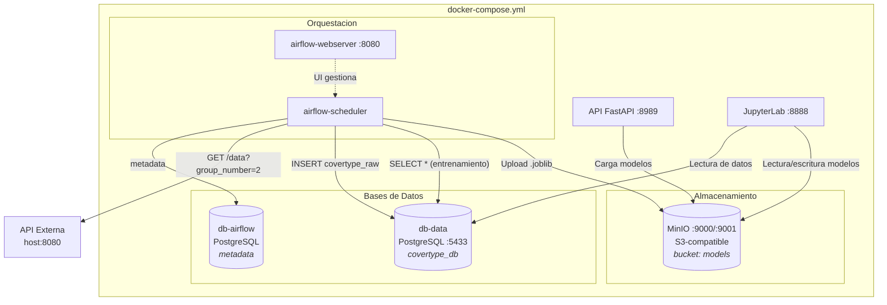
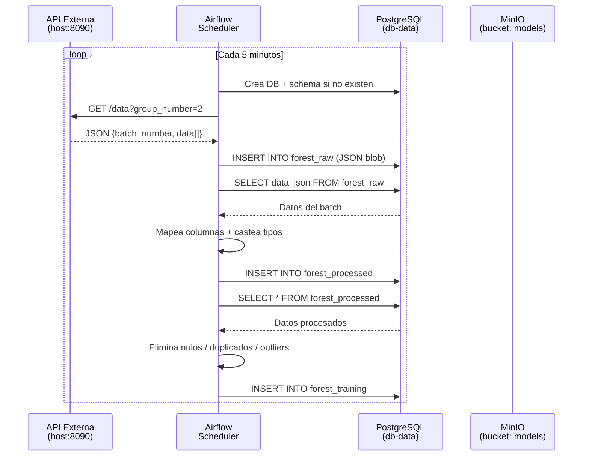
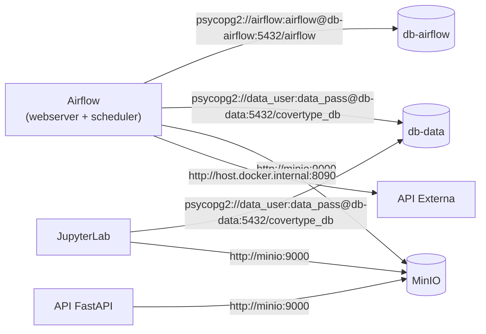
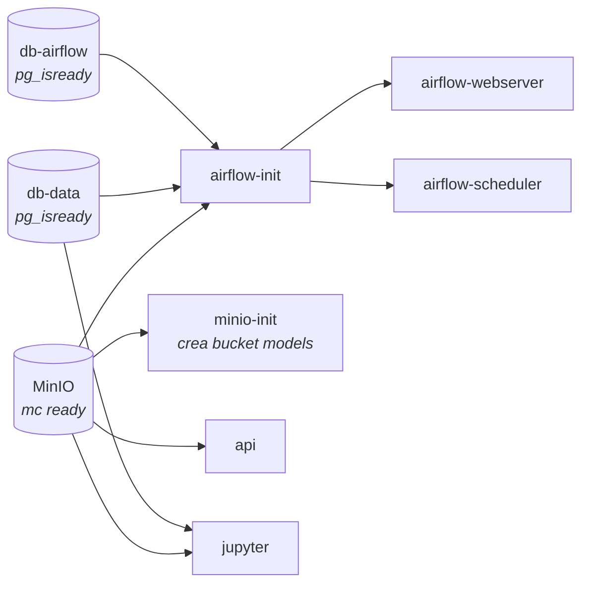

# Covertype ML Pipeline

Pipeline de Machine Learning orquestado con **Apache Airflow** para clasificar tipos de cobertura forestal ([Covertype Dataset](https://archive.ics.uci.edu/dataset/31/covertype)). El sistema consume datos desde una API externa cada 5 minutos, los procesa a través de un pipeline de 4 etapas (validación servidor → ingesta → transformación → limpieza), almacena modelos entrenados en **MinIO** (S3-compatible) y los sirve mediante una **API FastAPI** para inferencia en tiempo real.

---

## Arquitectura General



---

## Tablas PostgreSQL (`covertype_db`)

El pipeline mantiene tres tablas en la base de datos `covertype_db`, cada una representando una capa del procesamiento:

| Tabla | Descripcion |
|-------|-------------|
| `forest_raw` | Capa de auditoría. Almacena el JSON completo de cada batch (`batch_id`, `data_json`, `ingested_at`). Un registro por batch. |
| `forest_processed` | Capa transformada. Columnas nombradas y tipos correctos. Puede contener nulos o duplicados. |
| `forest_training` | Capa limpia. Lista para entrenar: sin nulos, sin duplicados, sin valores físicamente imposibles. Fuente de datos para JupyterLab. |

### Reglas de limpieza aplicadas en `clean_for_training`

- Eliminación de filas con cualquier valor nulo (`dropna`)
- Eliminación de duplicados exactos por features del dataset
- Filtro `Elevation > 0` (elevación negativa o cero no es válida)
- Filtro `Cover_Type` entre 1 y 7 (únicos valores válidos del dataset)


## Flujo de Datos

1. **Validación de infraestructura:** El DAG verifica conectividad con la API y la base de datos, crea la base de datos si no existe y provisiona el schema (`forest_raw`, `forest_processed`, `forest_training`).
2. **Ingesta RAW:** Descarga un lote desde la API externa y lo guarda en `forest_raw` como JSON para auditoría.
3. **Transformación:** Lee `forest_raw`, mapea las columnas posicionales del dataset Covertype, castea tipos y escribe en `forest_processed`.
4. **Limpieza para entrenamiento:** Elimina nulos, duplicados y valores físicamente imposibles de `forest_processed` y escribe el resultado limpio en `forest_training`.
5. **Inferencia:** La API FastAPI carga los modelos desde MinIO al iniciar y expone endpoints de prediccion.
6. **Experimentacion:** JupyterLab lee directamente de `forest_training` (ya limpia) para entrenar y evaluar modelos interactivamente.

---

## Consumo de la API Externa

El DAG `covertype_pipeline` (`dags/covertype_pipeline.py`) se ejecuta cada **5 minutos** y realiza el siguiente proceso:



**Detalles de la peticion:**
- **URL:** `http://host.docker.internal:8080/data`
- **Metodo:** GET
- **Parametro:** `group_number=2`
- **Respuesta:** JSON con `batch_number` (int) y `data` (array de registros con 13 features)
- **Timeout:** 120 segundos

**Features del dataset Covertype:**

| Feature | Tipo |
|---------|------|
| Elevation | float |
| Aspect | float |
| Slope | float |
| Horizontal_Distance_To_Hydrology | float |
| Vertical_Distance_To_Hydrology | float |
| Horizontal_Distance_To_Roadways | float |
| Hillshade_9am | float |
| Hillshade_Noon | float |
| Hillshade_3pm | float |
| Horizontal_Distance_To_Fire_Points | float |
| Wilderness_Area | string |
| Soil_Type | string |
| Cover_Type | int (target) |

---

## Conexiones entre Contenedores

### Red y Comunicacion Interna

Todos los contenedores operan en la red bridge por defecto de Docker Compose. La comunicacion interna usa **DNS de Docker** (nombre del servicio como hostname).



### Cadena de Dependencias (healthchecks)



### Puertos Expuestos

| Servicio | Puerto Host | Puerto Contenedor | URL |
|----------|-------------|-------------------|-----|
| Airflow Webserver | 8090 | 8080 | http://localhost:8080 |
| API FastAPI | 8989 | 8989 | http://localhost:8989 |
| JupyterLab | 8888 | 8888 | http://localhost:8888 |
| PostgreSQL (datos) | 5433 | 5432 | localhost:5433 |
| MinIO API | 9000 | 9000 | http://localhost:9000 |
| MinIO Console | 9001 | 9001 | http://localhost:9001 |

### Volumenes Persistentes

| Volumen | Contenedor | Proposito |
|---------|------------|-----------|
| `pgdata_data` | db-data | Datos PostgreSQL (covertype) |
| `pgdata_airflow` | db-airflow | Metadata de Airflow |
| `minio_data` | minio | Modelos y objetos almacenados |
| `./dags` | airflow-webserver, scheduler | Definiciones de DAGs |
| `./models` | api | Modelos entrenados (compartido) |
| `./jupyter/notebooks` | jupyter | Notebooks de experimentacion |

---

## Requisitos

- [Docker](https://docs.docker.com/get-docker/) con Docker Compose
- [Task](https://taskfile.dev/) (opcional, simplifica los comandos)

No necesitas Python instalado localmente; todo corre dentro de los contenedores.

---

## Inicio rapido

```bash
task up              # construir y levantar todos los servicios
task dag:unpause     # activar el DAG de covertype
task dag:trigger     # ejecutar el pipeline
```

O sin Task:

```bash
docker compose up -d --build
docker compose exec airflow-webserver airflow dags unpause covertype_pipeline
docker compose exec airflow-webserver airflow dags trigger covertype_pipeline
```

Una vez completado el DAG:

```bash
task health          # verificar estado de la API
task models          # listar modelos disponibles
task predict         # hacer una prediccion de prueba
```

---

## Servicios

| Servicio | Puerto | Descripcion |
|----------|--------|-------------|
| `airflow-webserver` | 8080 | UI de Airflow (usuario: `airflow`, password: `airflow`) |
| `airflow-scheduler` | - | Ejecuta los DAGs programados |
| `db-airflow` | - | PostgreSQL para metadata de Airflow |
| `db-data` | 5433 | PostgreSQL con datos de covertype |
| `minio` | 9000/9001 | Object storage S3-compatible (usuario: `minioadmin`, password: `minioadmin`) |
| `api` | 8989 | FastAPI para inferencia (docs en `/docs`) |
| `jupyter` | 8888 | JupyterLab para experimentacion |

---

## DAGs

### covertype_pipeline (cada 5 minutos)

Pipeline automatizado de ingesta y entrenamiento:

| Tarea | Descripcion |
|-------|-------------|
| `fetch_data` | Consume la API externa y obtiene un lote de datos |
| `store_data` | Inserta los datos en `covertype_raw` (PostgreSQL) |
| `train_models` | Entrena clasificadores y sube modelos a MinIO |

### penguins_pipeline (manual)

Pipeline de entrenamiento con el dataset Palmer Penguins:

| Tarea | Descripcion |
|-------|-------------|
| `clear_database` | Elimina tablas `penguins_raw` y `penguins_clean` |
| `load_raw_data` | Carga el dataset Palmer Penguins en `penguins_raw` |
| `preprocess_data` | Limpia datos, elimina nulos y guarda en `penguins_clean` |
| `train_model` | Entrena 3 clasificadores y sube a MinIO |

---

## Modelos

| Modelo | Algoritmo |
|--------|-----------|
| `random_forest` | RandomForestClassifier |
| `gradient_boosting` | GradientBoostingClassifier |
| `logistic_regression` | LogisticRegression |
| `mlp` / `mlp_small` / `mlp_medium` / `mlp_large` / `mlp_deep` | MLPClassifier (variantes) |
| `svm` | SVM |

Los modelos se almacenan como archivos `.joblib` en el bucket `models` de MinIO.

---

## API - Endpoints

### `GET /health`

```bash
curl http://localhost:8989/health
```
```json
{"status": "ok", "models_loaded": 3}
```

### `GET /models`

```bash
curl http://localhost:8989/models
```
```json
{"available": ["gradient_boosting", "logistic_regression", "random_forest"]}
```

### `POST /predict`

| Campo | Tipo | Ejemplo |
|-------|------|---------|
| `Elevation` | float | 2596.0 |
| `Aspect` | float | 51.0 |
| `Slope` | float | 3.0 |
| `Horizontal_Distance_To_Hydrology` | float | 258.0 |
| `Vertical_Distance_To_Hydrology` | float | 0.0 |
| `Horizontal_Distance_To_Roadways` | float | 510.0 |
| `Hillshade_9am` | float | 221.0 |
| `Hillshade_Noon` | float | 232.0 |
| `Hillshade_3pm` | float | 148.0 |
| `Horizontal_Distance_To_Fire_Points` | float | 6279.0 |
| `Wilderness_Area` | string | `"Rawah"` |
| `Soil_Type` | string | `"C7745"` |
| `model_name` | string | `"random_forest"` |

```bash
curl -X POST http://localhost:8989/predict \
  -H "Content-Type: application/json" \
  -d '{
    "Elevation": 2596.0,
    "Aspect": 51.0,
    "Slope": 3.0,
    "Horizontal_Distance_To_Hydrology": 258.0,
    "Vertical_Distance_To_Hydrology": 0.0,
    "Horizontal_Distance_To_Roadways": 510.0,
    "Hillshade_9am": 221.0,
    "Hillshade_Noon": 232.0,
    "Hillshade_3pm": 148.0,
    "Horizontal_Distance_To_Fire_Points": 6279.0,
    "Wilderness_Area": "Rawah",
    "Soil_Type": "C7745",
    "model_name": "random_forest"
  }'
```
```json
{"cover_type": "5", "model_used": "random_forest"}
```

### `POST /reload`

Recarga los modelos desde MinIO sin reiniciar el servicio.

```bash
curl -X POST http://localhost:8989/reload
```
```json
{"status": "reloaded", "models_loaded": 3}
```

### Errores

| Codigo | Causa |
|--------|-------|
| 404 | `model_name` no existe |
| 422 | Campos faltantes o tipos invalidos |
| 503 | No hay modelos cargados |

---

## Comandos Task

### Lifecycle

| Comando | Descripcion |
|---------|-------------|
| `task up` | Construir y levantar todos los servicios |
| `task down` | Detener y eliminar servicios |
| `task ps` | Ver estado de los contenedores |
| `task clean` | Detener servicios y eliminar volumenes (reset completo) |
| `task logs` | Logs de todos los servicios |

### API

| Comando | Descripcion |
|---------|-------------|
| `task health` | Verificar estado de la API |
| `task models` | Listar modelos disponibles |
| `task predict` | Prediccion de ejemplo |

### Base de datos

| Comando | Descripcion |
|---------|-------------|
| `task db:tables` | Listar tablas |
| `task db:count` | Contar registros por batch |
| `task db:query -- 'SELECT ...'` | Ejecutar SQL personalizado |

### Airflow

| Comando | Descripcion |
|---------|-------------|
| `task dag:trigger` | Disparar el pipeline |
| `task dag:unpause` | Activar el DAG |
| `task dag:pause` | Pausar el DAG |

---

## Estructura del proyecto

```
.
├── docker-compose.yml              # Orquestacion de todos los servicios
├── Taskfile.yml                    # Task runner (comandos rapidos)
├── airflow/
│   ├── Dockerfile                  # Imagen Airflow + dependencias ML
│   └── requirements.txt            # pandas, scikit-learn, minio, etc.
├── dags/
│   ├── covertype_pipeline.py       # DAG: ingesta API + entrenamiento (cada 5 min)
│   └── penguins_pipeline.py        # DAG: entrenamiento penguins (manual)
├── api/
│   ├── Dockerfile                  # Imagen API (python:3.12-slim + uv)
│   ├── pyproject.toml              # Dependencias de la API
│   └── app/
│       ├── main.py                 # Endpoints FastAPI + carga modelos MinIO
│       └── schemas.py              # Modelos Pydantic (request/response)
├── jupyter/
│   ├── Dockerfile                  # Imagen JupyterLab
│   ├── pyproject.toml              # Dependencias (matplotlib, seaborn, etc.)
│   └── notebooks/
│       └── train_models.ipynb      # Notebook de experimentacion
├── models/                         # Modelos entrenados (.joblib)
└── MLOPS_PUJ/                      # Submodulo educativo (niveles 0-4 MLOps)
```

---

## Tecnologias

- **Apache Airflow** - Orquestacion de pipelines ML
- **PostgreSQL** - Almacenamiento de datos y metadata
- **MinIO** - Object storage S3-compatible para modelos
- **FastAPI** - API de inferencia en tiempo real
- **JupyterLab** - Experimentacion interactiva
- **scikit-learn** - Entrenamiento de modelos
- **Docker Compose** - Orquestacion de contenedores
- **Task** - Task runner
- **uv** - Gestor de paquetes Python (API y Jupyter)
