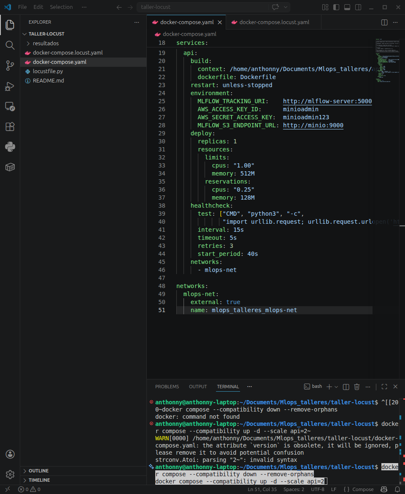
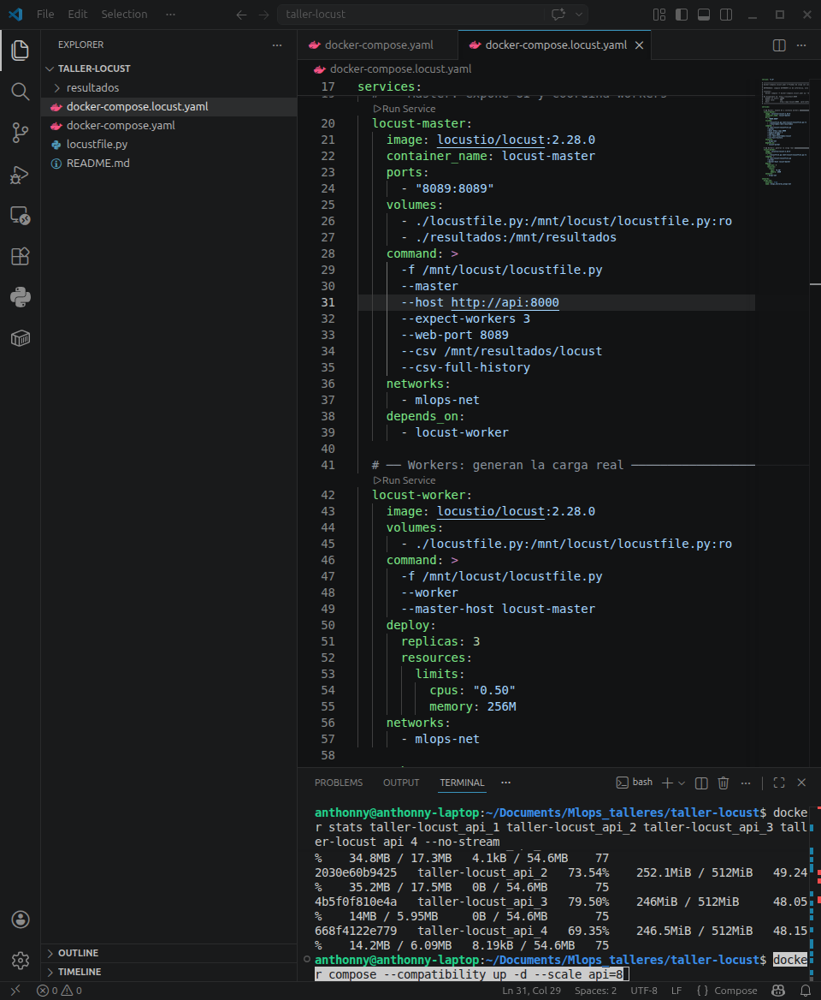
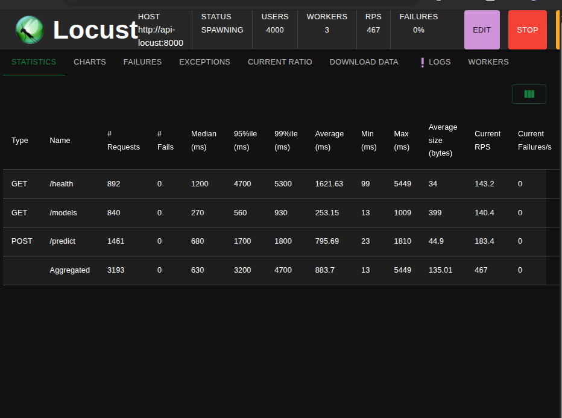
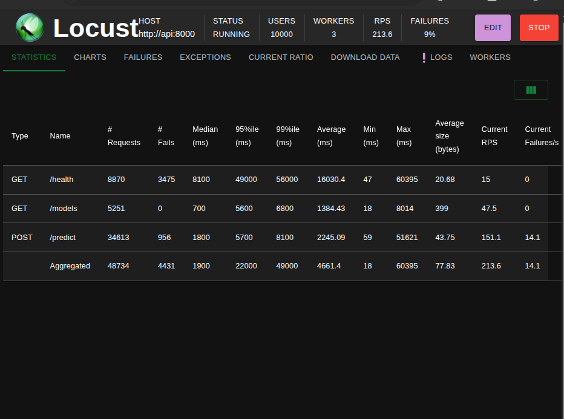
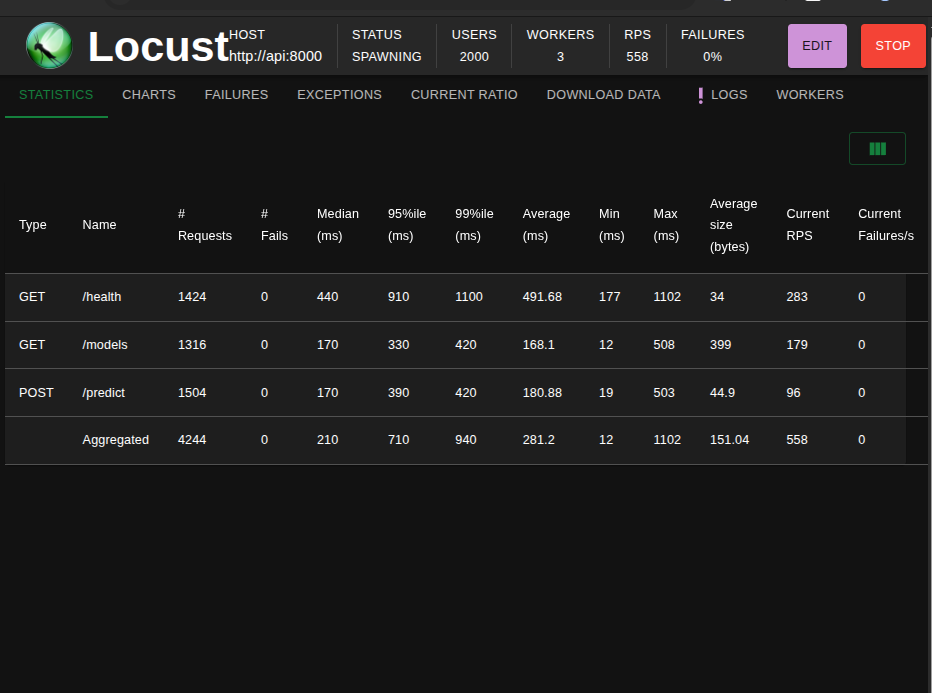
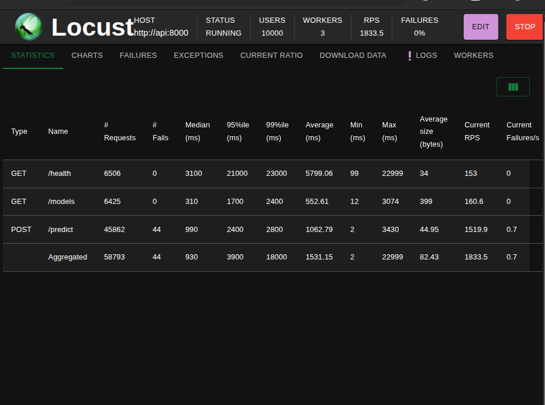

# Taller Locust — Pruebas de Carga con FastAPI + MLflow

**Curso:** MLOps — Pontificia Universidad Javeriana  
**Dataset:** Wine (sklearn)  
**Stack:** MLflow + MinIO + PostgreSQL + FastAPI + Locust  

---

## Descripción

Este taller implementa pruebas de carga (**stress testing** y **soak testing**) sobre una API de inferencia construida con FastAPI que consume modelos registrados en MLflow Model Registry. Se utilizó Locust para simular hasta **10 000 usuarios concurrentes** con un spawn rate de **500 usuarios/segundo**.

---

## Arquitectura

```
Locust Workers (x3)
       │
Locust Master ──► API de Inferencia (FastAPI) ──► MLflow Server
                        │                              │
                   N réplicas                      MinIO (artefactos)
                  (escalable)                          │
                                                  PostgreSQL (metadata)
```

---

## Estructura del proyecto

```
taller-locust/
├── docker-compose.yaml           # API de inferencia con recursos limitados
├── docker-compose.locust.yaml    # Pruebas de carga con Locust
├── locustfile.py                 # Script de carga (stress + soak)
├── imagenes/                     # Capturas de los experimentos
│   ├── 01_mlflow_runs.png
│   ├── 02_mlflow_models.png
│   ├── 03_locust_1_replica.png
│   ├── 04_locust_2_replicas.png
│   ├── 05_locust_4_replicas.png
│   ├── 06_locust_8_replicas.png
│   ├── 07_vscode_compose_api.png
│   └── 08_vscode_compose_locust.png
├── resultados/                   # CSVs exportados por Locust
└── README.md
```

---

## Prerrequisitos

El stack base debe estar corriendo:

```bash
cd ~/Documents/Mlops_talleres
docker compose up -d
```

---

## Paso 1 — Modelos entrenados en MLflow

Se entrenaron 24 modelos desde JupyterLab (**http://localhost:8889**, token: `taller2026`) ejecutando el notebook `01_experimentos_mlflow.ipynb`.

Los modelos se registraron en MLflow bajo el nombre `wine-classifier-production`.


---

## Paso 2 — Imagen Docker

La imagen se construye desde el `Dockerfile` del repo base y se publica en DockerHub:

```bash
docker build -t TU_USUARIO/wine-inference-api:1.0 \
  ~/Documents/Mlops_talleres/api/

docker login
docker push TU_USUARIO/wine-inference-api:1.0
```

---

## Paso 3 — docker-compose.yaml (API de inferencia)

Levanta la API usando la imagen publicada con límites de recursos configurables para el experimento.



```bash
cd ~/Documents/Mlops_talleres/taller-locust
docker compose --compatibility up -d --build
```

---

## Paso 4 — docker-compose.locust.yaml (Pruebas de carga)

Levanta Locust en modo distribuido: 1 master + 3 workers.



```bash
docker compose -f docker-compose.locust.yaml up -d
```

UI disponible en **http://localhost:8089**

Configuración:
- **Number of users:** 10 000
- **Spawn rate:** 500 usuarios/segundo
- **Host:** `http://api:8000`

---

## Paso 5 — Experimento de recursos mínimos (1 réplica)

Se probó con **1 réplica**, **1.00 CPU** y **512 MB** de memoria como baseline.

### Resultados con 1 réplica — 10 000 usuarios



| Endpoint | p95 (ms) | Failures | RPS |
|----------|----------|----------|-----|
| GET /health | 20 000 | 89% | 3.7 |
| GET /models | 2 100 | 0% | 0 |
| POST /predict | 3 600 | 4% | 239 |
| **Agregado** | **12 000** | **23%** | **239** |

**Uso de recursos:**
```
CPU: 74%  |  Memoria: 250 MB / 512 MB (48%)
```

**Conclusión:** Con 1 réplica la API **no soporta** 10 000 usuarios. El cuello de botella es el **CPU** saturado al 74%. La tasa de error del 23% supera el SLA del 1%.

---

## Paso 6 — Experimento de réplicas

### 2 réplicas — 10 000 usuarios



| Endpoint | p95 (ms) | Failures | RPS |
|----------|----------|----------|-----|
| POST /predict | 5 700 | 4% | 151 |
| **Agregado** | **22 000** | **9%** | **213** |

**Uso de recursos por réplica:**
```
api_1: CPU 28%  |  Memoria: 247 MB
api_2: CPU 31%  |  Memoria: 248 MB
```

---

### 4 réplicas — 10 000 usuarios



| Endpoint | p95 (ms) | Failures | RPS |
|----------|----------|----------|-----|
| POST /predict | 3 400 | 1.2% | 1 116 |
| **Agregado** | **8 400** | **3%** | **1 327** |

**Uso de recursos por réplica:**
```
api_1: CPU 62%  |  api_2: CPU 73%  |  api_3: CPU 79%  |  api_4: CPU 69%
```

---

### 8 réplicas — 10 000 usuarios ✅



| Endpoint | p95 (ms) | Failures | RPS |
|----------|----------|----------|-----|
| GET /health | 21 000 | 0% | 153 |
| GET /models | 1 700 | 0% | 160 |
| POST /predict | 2 400 | 0.06% | 1 519 |
| **Agregado** | **3 900** | **0%** | **1 833** |

**Uso de recursos por réplica:**
```
api_1: CPU 39%  |  api_2: CPU 44%  |  api_3: CPU 39%  |  api_4: CPU 37%
api_5: CPU 24%  |  api_6: CPU 22%  |  api_7: CPU 19%  |  api_8: CPU 25%
```

---

## Tabla comparativa final

| Réplicas | Failures | RPS | /predict p95 | CPU por réplica |
|----------|----------|-----|--------------|-----------------|
| 1        | 23%      | 239 | 3 600 ms     | 74%             |
| 2        | 9%       | 213 | 5 700 ms     | ~30%            |
| 4        | 3%       | 1 327 | 3 400 ms   | ~70%            |
| **8**    | **0%**   | **1 833** | **2 400 ms** | **~30%**   |

---

## Respuestas a las preguntas del taller

### ¿Es posible reducir más los recursos por réplica al escalar?

Sí. Con 8 réplicas cada contenedor usa solo ~25-40% de CPU, lo que indica que se podría reducir el límite a **0.50 CPU** por réplica manteniendo el rendimiento. La memoria se mantiene estable en ~245 MB independientemente de la carga, por lo que **256 MB** sería suficiente por réplica.

### ¿Cuál es la mayor cantidad de peticiones soportadas?

Con 8 réplicas se alcanzaron **1 833 RPS** totales a 10 000 usuarios concurrentes con 0% de failures. El endpoint `/predict` específicamente alcanzó **1 519 RPS**.

### ¿Qué diferencia hay entre una o múltiples instancias?

| Aspecto | 1 instancia | 8 instancias |
|---------|-------------|--------------|
| Failures | 23% | 0% |
| RPS | 239 | 1 833 (+667%) |
| /predict p95 | 3 600 ms | 2 400 ms |
| Resiliencia | Sin tolerancia a fallos | Alta disponibilidad |
| CPU total usado | 74% de 1 core | ~30% de 8 cores |

Con una sola instancia el GIL de Python y los 2 workers de uvicorn limitan el paralelismo real. Con múltiples réplicas Docker distribuye las conexiones en round-robin entre los contenedores, logrando escala casi lineal hasta saturar el CPU del host.

### ¿Se llegó a 10 000 usuarios?

**Sí** — se llegó a 10 000 usuarios con spawn rate de 500/segundo en todas las pruebas. Con 8 réplicas se logró mantener 0% de failures y 1 833 RPS sostenidos.

---

## Comandos útiles

```bash
# Ver uso de recursos en tiempo real
docker stats

# Escalar réplicas
docker compose --compatibility up -d --scale api=N

# Detectar OOMKilled
docker inspect CONTAINER_NAME | grep OOMKilled

# Bajar todo
docker compose --compatibility down
docker compose -f docker-compose.locust.yaml down
```
